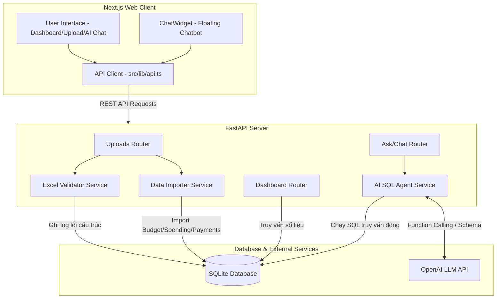
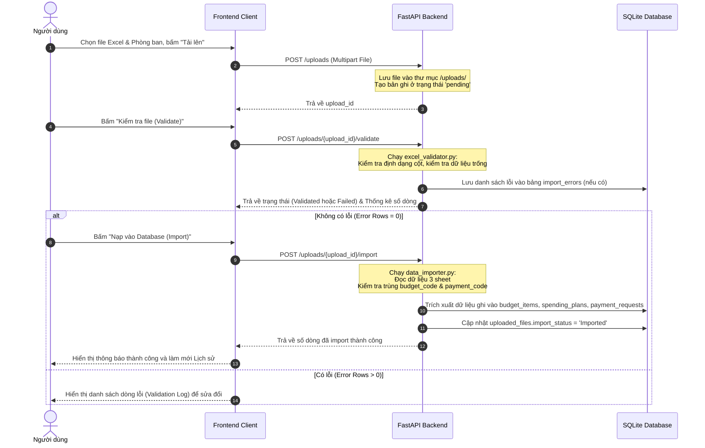
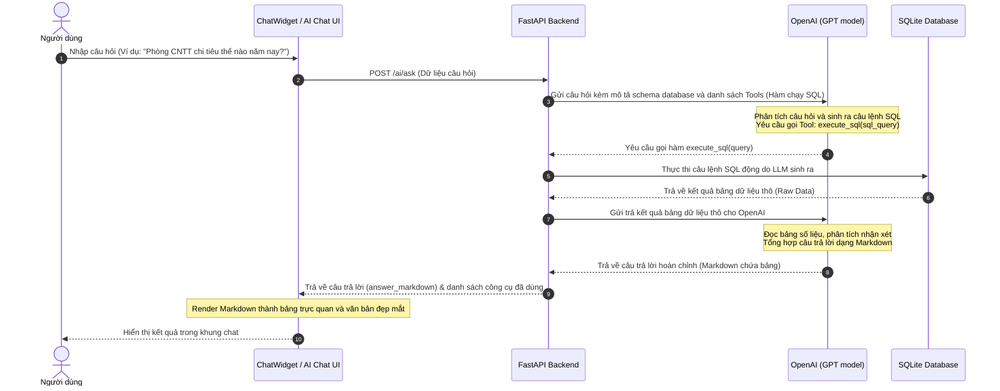

# Sơ đồ Kiến trúc & Luồng dữ liệu (Architecture & Data Flow)

Hệ thống được thiết kế theo kiến trúc tách biệt hoàn toàn giữa **Frontend (Next.js)** và **Backend (FastAPI)**, giao tiếp thông qua **RESTful API** và tích hợp sức mạnh của **LLM (OpenAI API)** thông qua cơ chế **Function Calling (SQL Agent)**.

---

## 1. Sơ đồ các Thành phần (Component Diagram)

---

## 2. Luồng dữ liệu Chi tiết (Detailed Data Flows)

### A. Luồng Tải lên và Nạp dữ liệu Excel (Excel Upload & Import Flow)

### B. Luồng Hỏi đáp Dữ liệu bằng AI (AI Chat & SQL Tool Flow)

